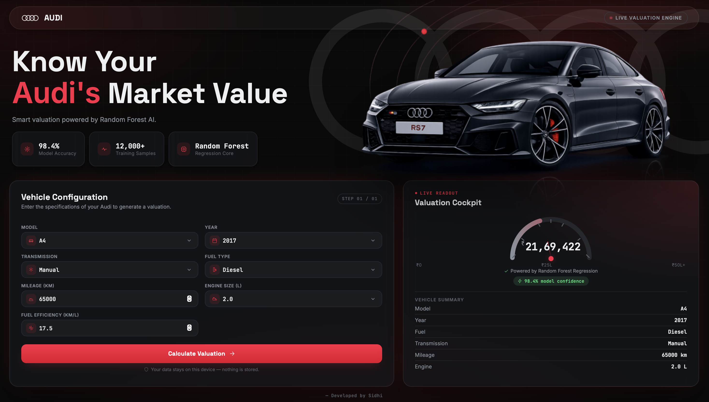

<h1 align="center">Audi Car Price Predictor</h1>

<p align="center">
  <strong>AI-powered web application for predicting the market value of Audi cars.</strong>
</p>

<p align="center">
Built using <b>Flask</b>, <b>Scikit-learn</b>, and <b>Random Forest Regression</b> to provide fast and accurate resale price predictions based on real-world vehicle specifications.
</p>

<p align="center">
  <a href="https://your-render-url.onrender.com"><strong>🌐 Live Demo</strong></a>
  •
  <a href="https://github.com/yourusername/audi-car-price-predictor"><strong>📂 Source Code</strong></a>
  •
  <a href="https://www.linkedin.com/in/your-linkedin"><strong>💼 LinkedIn</strong></a>
</p>

---

## 📸 Preview

<p align="center">
  
</p>

---

## ✨ Features

- 🚘 Predicts Audi resale prices instantly
- 🤖 Machine Learning-powered predictions using Random Forest Regression
- 📊 Trained on real-world Audi vehicle data
- 💰 Automatic GBP to INR price conversion
- 🎨 Premium Audi-inspired responsive interface
- ⚡ Fast and lightweight Flask backend
- ☁️ Deployed on Render

---

## 🛠️ Tech Stack

| Category | Technologies |
|----------|--------------|
| Frontend | HTML5, CSS3, Jinja2 |
| Backend | Flask, Python |
| Machine Learning | Scikit-learn, Random Forest Regression |
| Data Processing | Pandas, NumPy |
| Model Persistence | Joblib |
| Deployment | Render, Gunicorn |

---

## 📂 Project Structure

```text
Audi-Car-Price-Predictor/
│
├── app.py
├── audi_price_model.pkl
├── requirements.txt
├── README.md
│
├── templates/
│   └── index.html
│
├── static/
│   ├── style.css
│   ├── audi.jpg
│   └── audi-logo.png
│
└── images/
    └── preview.png
```

---

## 📊 Model Inputs

The prediction is based on the following vehicle specifications:

- Audi Model
- Manufacturing Year
- Transmission Type
- Fuel Type
- Mileage
- Fuel Efficiency
- Engine Size

---

## 🧠 Machine Learning Pipeline

```text
Dataset
   │
   ▼
Data Cleaning
   │
   ▼
Feature Engineering
   │
   ▼
One-Hot Encoding
   │
   ▼
Train-Test Split
   │
   ▼
Random Forest Regression
   │
   ▼
Model Evaluation
   │
   ▼
Model Serialization (Joblib)
   │
   ▼
Flask Web Application
   │
   ▼
Deployment on Render
```

---

## 🚀 Getting Started

### 1️⃣ Clone the Repository

```bash
git clone https://github.com/yourusername/audi-value-predictor.git
cd audi-value-predictor
```

### 2️⃣ Create a Virtual Environment (Optional)

**Windows**

```bash
python -m venv venv
venv\Scripts\activate
```

**macOS / Linux**

```bash
python3 -m venv venv
source venv/bin/activate
```

### 3️⃣ Install Dependencies

```bash
pip install -r requirements.txt
```

### 4️⃣ Run the Application

```bash
python app.py
```

### 5️⃣ Open in Browser

```
http://127.0.0.1:5000
```

---

## 📈 Model Information

| Model | Random Forest Regression |
|------|---------------------------|
| Target Variable | Price |
| Framework | Scikit-learn |
| Output | Estimated Audi Market Value |

---

## 🔮 Future Improvements

- Support for multiple car brands
- Live market price integration
- Interactive price trend visualization
- REST API support
- User accounts and saved predictions
- Advanced model comparison dashboard

---

## 👩‍💻 About the Developer

**Sidhi Deshmukh**

Aspiring Data Analyst and Machine Learning Enthusiast passionate about building data-driven applications and solving real-world problems with AI.

---
